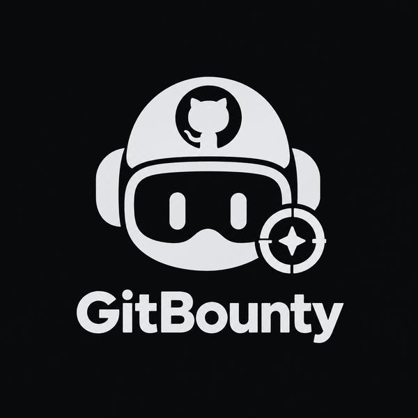

<p align="center">
  
</p>

<h1 align="center">GitBounty</h1>

<p align="center">
  <strong>Open-source work, paid the day it ships.</strong><br/>
  Maintainers attach a dollar amount to any GitHub issue. Contributors merge a fix and get paid straight to their wallet — no invoices, no 20% cut, no five-day wait.
</p>

<p align="center">
  📖 New here? Read <a href="overview.md"><strong>overview.md</strong></a> first — the plain-language explanation of
  what this project actually is, including an open question about the product that this README hasn't caught up to yet.
</p>

<p align="center">
  <a href="#-the-problem">Problem</a> ·
  <a href="#-how-it-works">How it works</a> ·
  <a href="#-architecture">Architecture</a> ·
  <a href="#-status">Status</a> ·
  <a href="#-tech-stack">Tech stack</a> ·
  <a href="#-getting-started">Getting started</a> ·
  <a href="#-repo-layout">Repo layout</a> ·
  <a href="#-security">Security</a> ·
  <a href="#-roadmap">Roadmap</a> ·
  <a href="#-working-on-this-repo">Working on this repo</a>
</p>

<p align="center">
  
  
  
  
</p>

---

## 🎯 The problem

90 %+ of enterprise software is built on open-source, yet the people fixing bugs and shipping features are almost never compensated. Existing platforms that try to solve this have three recurring problems:

| Problem | Status quo |
|---|---|
| **High commissions** | Upwork / Fiverr-style platforms take 10–20 % of every payment |
| **Slow payouts** | Manual release cycles run 5–14 days after work is verified |
| **Context switching** | Separate dashboards, dispute portals, and invoice flows pull contributors away from GitHub |

GitBounty collapses all three into a single, GitHub-native loop: label → escrow → merge → paid.

---

## ✨ How it works

```
Maintainer labels issue          Contributor opens PR
        │                                 │
        ▼                                 ▼
  ┌─────────────┐               ┌──────────────────┐
  │  $X bounty  │               │  PR merged into   │
  │  label set  │               │  main / master    │
  └──────┬──────┘               └────────┬─────────┘
         │                               │
         ▼                               ▼
  Funds deposited              Webhook fires → escrow
  into escrow                  releases to contributor
  immediately                  wallet — same day
```

1. **Tag the issue** — a maintainer adds a `$100 bounty` label. Funds move into escrow immediately.
2. **Escrow holds it** — a chain-agnostic Solidity contract locks ERC-20 stablecoins until work is verified as done.
3. **Contributor merges** — anyone picks up the issue, opens a PR, and gets it reviewed as usual.
4. **Wallet gets paid** — the `pull_request.merged` webhook releases escrow directly to the contributor's embedded wallet, the same day.

### Who it's for

- **Maintainers** attach bounties from the issue itself, see every open and paid bounty in one place, and get funds back automatically if a bounty goes stale.
- **Contributors** browse funded issues (filter by language, label, amount), sign in with GitHub to get a non-custodial wallet, and are paid on merge without invoicing anyone.

### Pricing idea

0 % platform commission for individuals. A premium organisation tier (analytics, split payouts) comes later.

---

## 🏗️ Architecture

GitBounty is a lean, event-driven system split into four layers:

```
┌──────────────────────────────────────────────────────────────────┐
│  CLIENT LAYER                                                    │
│  Website: bounty explorer, maintainer dashboard, wallet UI       │
│  Chrome extension (optional): bounty badges on GitHub issues     │
└────────────────────────────┬─────────────────────────────────────┘
                             │  GitHub login + REST
                             ▼
┌──────────────────────────────────────────────────────────────────┐
│  EVENT & INTEGRATION ENGINE  (backend)                           │
│  Webhook listener + REST API                                     │
│  Handles: issues.labeled / issues.closed / pull_request.merged  │
│  All payloads verified with per-repo HMAC secrets                │
└────────────────────────────┬─────────────────────────────────────┘
                             │  State reads / writes
                             ▼
┌──────────────────────────────────────────────────────────────────┐
│  PERSISTENCE / STATE STORE  (Postgres on Supabase)               │
│  Tracks: users, bounties, repositories, webhook delivery status  │
└────────────────────────────┬─────────────────────────────────────┘
                             │  on-chain calls
                             ▼
┌──────────────────────────────────────────────────────────────────┐
│  ESCROW CONTRACT (Solidity)                                      │
│  EVM contract — holds ERC-20 / stablecoins                       │
│  Four functions: deposit · claim · release · refund              │
│  Releases automatically on verified merge event                  │
└──────────────────────────────────────────────────────────────────┘
```

### Data flow — step by step

| Step | Trigger | What happens |
|---|---|---|
| 1 | Maintainer sets bounty label | Client calls REST API → funds deposited into escrow contract |
| 2 | GitHub fires `issues.labeled` | Event engine verifies HMAC signature, records bounty in state store |
| 3 | Contributor opens PR | No action — standard GitHub flow |
| 4 | Maintainer merges PR | GitHub fires `pull_request.merged` |
| 5 | Event engine receives webhook | Verifies HMAC, looks up bounty → calls contract `release()` |
| 6 | Escrow contract executes | ERC-20 transfer to contributor's embedded wallet |
| 7 | Client updates | Dashboard shows bounty as `Paid`, contributor sees balance |

### Smart contract interface (planned)

```solidity
// Simplified interface — the contract is planned as contracts/GitBountyEscrow.sol (not in the repo yet)

function deposit(
    bytes32 issueId,
    address token,
    uint256 amount
) external;

function claim(bytes32 issueId) external;

function release(
    bytes32 issueId,
    address contributor
) external onlyEngine;

function refund(bytes32 issueId) external;   // timelock-gated
```

The escrow holds funds until `release()` is called by the trusted event engine address. A configurable timelock on `refund()` returns stale bounties to the maintainer automatically, so nothing gets stuck.

---

## 📍 Status

Only the website demo exists in this repo today. Everything else is design.

| Area | Folder | State |
|---|---|---|
| Website | [`frontend/web/`](frontend/web) | **Demo built.** Plain HTML/CSS/JS with sample data, no API calls |
| Chrome extension | [`frontend/extension/`](frontend/extension) | Not started. Optional add-on |
| Backend | [`backend/`](backend) | Not started, stack not chosen |
| Database | [`migrations/`](migrations) | Postgres on a teammate's Supabase. No migrations written yet |
| Escrow contract | `contracts/` | Not started, folder not created |

### What the website demo shows

- A hero with a live mini-board of the top bounties, and a facts strip
- **Open bounties** board with search, label filters (enhancement, bug, docs, good first issue) and sorting, over sample data in `script.js`
- How it works, why GitBounty, a maintainers-vs-contributors split, an "under the hood" security section and a pricing section
- Several colour themes (black and gold by default), saved in the browser

The site does not depend on the extension.

---

## 🛠️ Tech stack

Some choices are made and some are open. The original plan (Next.js, Node, Prisma, Dynamic SDK, Hardhat) was a proposal and is being re-evaluated.

| Layer | State | Notes |
|---|---|---|
| **Website** | Demo in plain HTML/CSS/JS | Framework for the real app not chosen |
| **Extension** | Chrome Manifest V3 | Not started. See [`frontend/extension/`](frontend/extension/README.md) |
| **Backend** | Not chosen | Must verify login, serve a REST API, receive GitHub webhooks and call the escrow contract |
| **Database** | Postgres on Supabase | Hosted in a teammate's account. Schema changes are plain SQL files in [`migrations/`](migrations) |
| **Wallets** | Planned: Dynamic SDK | Non-custodial embedded wallets from a GitHub login, no seed phrases. Not confirmed |
| **Smart contract** | Planned: Solidity on an EVM chain | Four-function escrow holding ERC-20 stablecoins (USDC), testnet first. Chain not chosen |

### Webhook security (illustration)

Every webhook is verified using a per-repository HMAC secret before touching any escrow logic. This sketch is in JavaScript only because the backend language isn't chosen yet:

```js
const sig = req.headers['x-hub-signature-256'];
const expected = `sha256=${createHmac('sha256', repo.webhookSecret)
  .update(rawBody)
  .digest('hex')}`;

if (!timingSafeEqual(Buffer.from(sig), Buffer.from(expected))) {
  return res.status(401).json({ error: 'Invalid signature' });
}
```

Forged or replayed events never reach escrow.

---

## 🚀 Getting started

### Run the website demo

```bash
cd frontend/web
python3 -m http.server 8000
# open http://localhost:8000
```

Any static file server works, and opening `index.html` directly does too.

### Database

Migrations are plain SQL files in [`migrations/`](migrations), applied in numeric order by whoever owns the Supabase project. There are none yet. See [`migrations/README.md`](migrations/README.md).

### Backend, extension, contract

Not started. There is nothing to install or run for these yet.

### Planned configuration

Nothing reads these yet. This is the list the backend is expected to need:

```env
# GitHub login
GITHUB_CLIENT_ID=
GITHUB_CLIENT_SECRET=
GITHUB_WEBHOOK_SECRET=        # global fallback; per-repo secrets stored in the database

# Wallet provider
WALLET_PROVIDER_ENV_ID=

# Database (Supabase connection string)
DATABASE_URL=

# Chain / contract
RPC_URL=
ESCROW_CONTRACT_ADDRESS=
ENGINE_PRIVATE_KEY=            # the wallet that calls release() on-chain

# App
APP_URL=http://localhost:8000
```

### Registering a GitHub webhook (once the backend exists)

In a test repo: **Settings → Webhooks → Add webhook**

| Field | Value |
|---|---|
| Payload URL | `https://<your-tunnel>/api/webhook/github` |
| Content type | `application/json` |
| Secret | the webhook secret |
| Events | `Issues`, `Pull requests` |

For local testing, expose the backend with [ngrok](https://ngrok.com) or [smee.io](https://smee.io).

---

## 📁 Repo layout

```
gitbounty/
├── frontend/
│   ├── web/                # The website (demo today)
│   │   ├── index.html
│   │   ├── styles.css
│   │   ├── script.js
│   │   └── assets/         # Logo, logo mark, favicon
│   └── extension/          # Chrome extension (optional, not started)
├── backend/                # API + webhook receiver (not started)
├── migrations/             # Every SQL change to the database
├── contracts/              # Escrow contract (planned, not created yet)
├── CLAUDE.md               # Entry point for Claude Code
├── agent.md                # Guide for any AI coding agent
├── rules.md                # Rules for everyone working in this repo
└── readme.md
```

---

## 🔐 Security

| Concern | Mitigation |
|---|---|
| **Forged webhooks** | Per-repo HMAC secrets verified on every request using a constant-time comparison |
| **Replayed events** | Webhook delivery IDs stored in the database; duplicates rejected |
| **Stale bounties** | Configurable timelock on `refund()` — maintainer gets funds back automatically |
| **Contract risk** | Minimal 4-function surface area; no upgradeable proxy pattern by default |
| **Private key exposure** | Engine key used only for `release()` calls; recommend an MPC wallet or KMS in production |
| **Custody** | Contributor wallets are non-custodial — GitBounty never holds user funds directly |

---

## 🗺️ Roadmap

### MVP (hackathon scope)
- [x] Website demo with bounty explorer UI (sample data, no backend)
- [ ] Maintainer dashboard
- [ ] GitHub login + embedded wallet provisioning
- [ ] Bounty label → escrow deposit flow
- [ ] Webhook listener with HMAC verification
- [ ] `pull_request.merged` → automatic escrow release
- [ ] Escrow contract deployment (testnet)
- [ ] End-to-end integration test

### Post-MVP
- [ ] Browser extension: bounty badge overlay on GitHub issues
- [ ] Multi-contributor bounty splits
- [ ] Milestone streaming (partial payouts on intermediate PRs)
- [ ] AI-assisted bounty amount estimation
- [ ] Per-organization spend analytics
- [ ] Multi-chain support (Polygon, Base, Arbitrum)
- [ ] Dispute / arbitration flow

---

## 🤝 Working on this repo

Read [`rules.md`](rules.md) first. The two rules that catch people out: **read the git history before you start**, and **commit every small step**. AI coding agents should also read [`agent.md`](agent.md) (Claude Code loads it through [`CLAUDE.md`](CLAUDE.md)).

Database changes go in [`migrations/`](migrations) as new numbered SQL files.

---

<p align="center">
  Made with ☕ and a lot of unmerged PRs.
</p>
